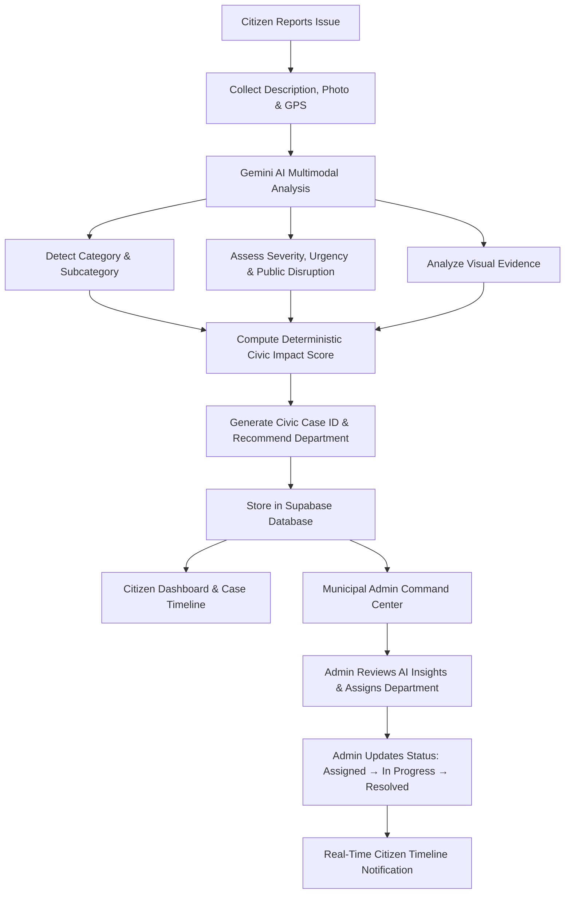
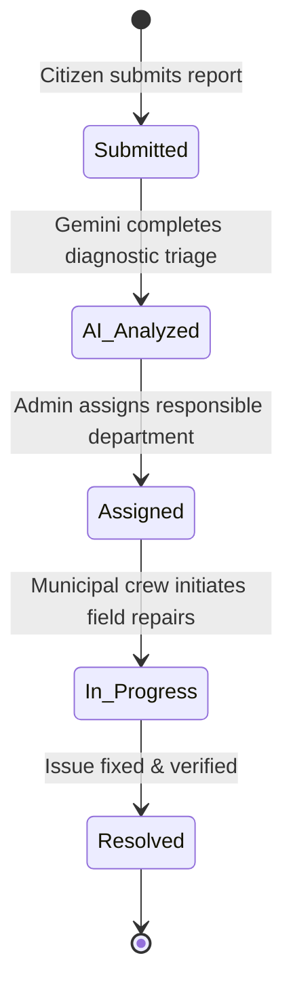
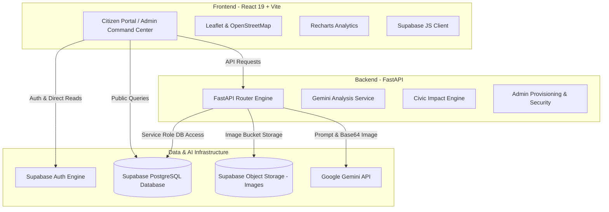
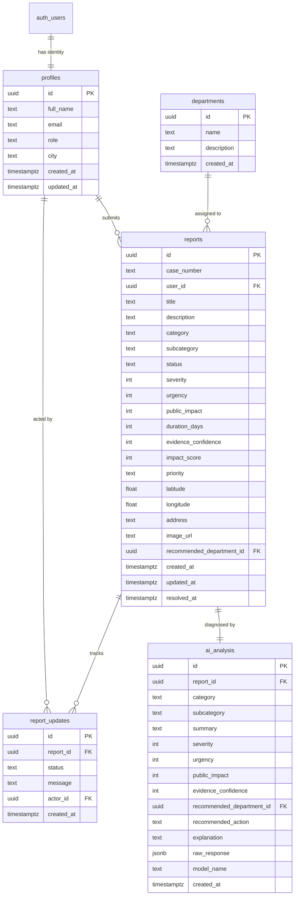

# CivicPulse AI

**From Citizen Voice to Civic Action**

CivicPulse AI is an AI-powered civic issue reporting and municipal response platform that transforms everyday community complaints into structured, prioritized, explainable, and actionable civic cases.

By integrating Google Gemini multimodal AI with real-time geospatial mapping, deterministic civic impact scoring, and municipal command workflows, CivicPulse AI bridges the communication gap between citizens and local government authorities.

---

## 1. Problem Statement

Municipal complaint management systems in modern cities suffer from critical operational bottlenecks:

- **Fragmented & Incomplete Reporting:** Complaints lack essential context, clear descriptions, or photographic evidence.
- **Incorrect Categorization & Misrouting:** Reports are manually classified or routed to the wrong municipal departments, causing delays.
- **Unclear Urgency & Severity Triage:** Without automated diagnostic scoring, high-risk hazards (e.g., exposed live wiring, deep road sinkholes) get lost in backlogs alongside routine issues.
- **Lack of Citizen Visibility:** Citizens submit complaints into a "black box" with little or no feedback regarding investigation or repair progress.
- **Limited Municipal Analytics:** Administrative teams lack geospatial hotspot intelligence, department resolution velocity metrics, and civic trend analysis.

CivicPulse AI resolves these challenges through an end-to-end platform that automates intake diagnostics, computes explainable impact scores, routes cases to the proper departments, and provides transparent timeline tracking.

---

## 2. Solution Workflow



---

## 3. Key Features

### Citizen Portal

| Feature | Description |
| :--- | :--- |
| **Authentication & Profiles** | Secure registration and login via Supabase Auth with regional municipal profile management. |
| **Multimodal Reporting** | Submit civic issues with concise titles, detailed descriptions, photographic evidence, and automatic GPS coordinate detection. |
| **AI Category & Subcategory Detection** | Automatic identification of municipal domain (Roads, Sanitation, Electricity, Water, Safety, etc.) with sub-issue classification. |
| **AI Diagnostic Explanation** | Plain-language AI summary, reasoning breakdown ("Why this result?"), and recommended municipal actions. |
| **Visual Evidence Analysis** | Computer vision analysis identifying physical defects, estimating visual severity, and computing evidence confidence. |
| **Civic Impact Scoring** | Transparent, deterministic 0–100 impact score showing exact factor weights (severity, urgency, public disruption, duration, confidence). |
| **Authoritative Case ID** | Automatic generation of traceable municipal case identifiers (e.g., `CP-2026-000042`). |
| **Case Tracking & Timeline** | Live, stage-by-stage status timeline tracking (Submitted → AI Analyzed → Assigned → In Progress → Resolved). |
| **Community Pulse Map** | Interactive geospatial map rendering verified civic reports with priority-coded markers, popup summaries, and "Locate Me" features. |

### Municipal Administrator Command Center

| Feature | Description |
| :--- | :--- |
| **Role-Based Security** | Dedicated administrative authentication protected by backend invitation verification and database security triggers. |
| **Executive Overview** | Real-time metrics tracking Total Cases, Critical Incidents, Pending Workorders, Resolved Cases, and Resolution Rates. |
| **Case Triage & Inspection** | Filterable case registry by status, category, and priority with detailed AI diagnostic summaries and image evidence. |
| **Department Routing** | Manual department assignment with full separation between AI-recommended department and official administrator assignment. |
| **Status Management** | Case transitions logged to audit timeline with timestamp, actor identification, and citizen-facing status updates. |
| **Civic Analytics & Trends** | Interactive charts (Recharts) displaying 30-day reporting volume trends, category breakdowns, and priority distributions. |
| **Geospatial Hotspots** | Grid-based clustering identifying geographic clusters of high-density civic infrastructure failure. |
| **Data-Driven Insights** | Automated summary observations highlighting critical problem areas and municipal performance. |

---

## 4. AI Capabilities (Google Gemini)

CivicPulse AI uses Google Gemini multimodal models to perform objective, structured civic intake analysis:

### 1. Text Intelligence
- **Domain Categorization:** Classifies issues into standardized municipal categories (*Roads & Infrastructure, Waste Management, Water & Drainage, Electricity & Public Lighting, Public Safety, Sanitation, General Civic Services*).
- **Subcategory Pinpointing:** Identifies specific sub-defects (*e.g., Pothole, Broken Streetlight, Water Leak, Illegal Dumping*).
- **Severity & Urgency Assessment:** Estimates physical hazard severity (*Low, Moderate, High, Critical*) and response urgency (*Low, Medium, High, Immediate*).
- **Public Disruption Index:** Evaluates potential scale of citizen disruption.
- **Department Routing Recommendation:** Identifies the responsible municipal department.
- **Citizen Explanation & Recommended Action:** Generates actionable remediation steps and explainable logic distinguishing observed evidence from inference.

### 2. Image Intelligence
- **Defect Detection:** Identifies physical damage, structural hazards, and environmental contamination from citizen photos.
- **Visual Severity & Evidence Confidence:** Computes a visual confidence rating (0–100%) to validate authenticity.

> **Decision Support Principle:** AI output serves as intelligent diagnostic assistance for municipal staff. Final department assignments, dispatch orders, and status approvals remain under municipal administrative control.

---

## 5. Civic Impact Score Engine

The Civic Impact Score is a **deterministic, explainable 0–100 score** calculated via weighted municipal factors:

$$\text{Impact Score} = (S \times 0.30) + (U \times 0.30) + (P \times 0.25) + (D \times 0.05) + (C \times 0.10)$$

| Factor | Weight | Score Mapping |
| :--- | :---: | :--- |
| **Severity ($S$)** | 30% | Low: 25 \| Moderate: 50 \| High: 75 \| Critical: 100 |
| **Urgency ($U$)** | 30% | Low: 25 \| Medium: 50 \| High: 75 \| Immediate: 100 |
| **Public Impact ($P$)** | 25% | Low: 25 \| Moderate: 50 \| High: 75 \| Critical: 100 |
| **Unresolved Duration ($D$)** | 5% | Base 10 for new reports, scaling +10/day up to 100 |
| **Evidence Confidence ($C$)** | 10% | 0 to 100 based on AI multimodal confidence |

### Priority Thresholds
- **CRITICAL:** 75 – 100
- **HIGH:** 50 – 74
- **MODERATE:** 25 – 49
- **LOW:** 0 – 24

---

## 6. Case Lifecycle



Every lifecycle transition records an immutable audit entry in `report_updates` containing the actor ID, timestamp, status label, and status update message displayed on the citizen case timeline.

---

## 7. System Architecture



---

## 8. Technology Stack

| Layer | Technology | Version | Purpose |
| :--- | :--- | :--- | :--- |
| **Frontend Framework** | React | 19.2 | Component-driven user interface |
| **Build Tool** | Vite | 8.3 | Lightning-fast development & client bundling |
| **Styling & Design** | Tailwind CSS | 4.3 | Responsive, dark/light theme civic styling |
| **Icons** | Lucide React | 1.48 | Accessible iconography |
| **Mapping** | Leaflet / React-Leaflet | 1.9 / 5.0 | Interactive geospatial mapping & markers |
| **Data Visualization** | Recharts | 3.10 | Civic analytics, trends, and distribution charts |
| **Backend Framework** | FastAPI | 0.141 | High-performance asynchronous Python API |
| **ASGI Server** | Uvicorn | 0.54 | Production-ready ASGI server |
| **Data Validation** | Pydantic | 2.13 | Strict schema and type validation |
| **AI Diagnostic Engine** | Google Gemini API | 1.5/2.0 | Multimodal text & computer vision intelligence |
| **Database & Auth** | Supabase / PostgreSQL | 2.117 (JS) | Relational database, JWT auth, and Row Level Security |

---

## 9. Database Design



---

## 10. Security & Access Control

- **Role-Based Access Control (RBAC):** Users are partitioned into `citizen` and `admin` roles. Citizens accessing administrative routes (`/admin`, `/admin/analytics`) are automatically redirected to `/dashboard`.
- **Database Role Protection:** PostgreSQL security definer trigger `protect_profile_role` intercepts `UPDATE` queries on `public.profiles` from standard client tokens to prevent malicious privilege escalation.
- **Row Level Security (RLS):** All tables (`profiles`, `reports`, `ai_analysis`, `departments`, `report_updates`) enforce granular RLS policies.
- **Secret Isolation:** High-privilege keys (`SUPABASE_SERVICE_ROLE_KEY`, `GEMINI_API_KEY`) remain strictly on the backend server and are never exposed to browser bundles or `VITE_*` variables.
- **Input Sanitization & Validation:** All API requests are strictly validated using Pydantic schemas before processing.

---

## 11. Environment Variables

### Backend (`backend/.env`)
```env
# Server Configuration
PORT=8000
ENVIRONMENT=development

# Supabase Service Credentials (Backend Only)
SUPABASE_URL=https://your-project.supabase.co
SUPABASE_SERVICE_ROLE_KEY=your_supabase_service_role_key

# Google Gemini API
GEMINI_API_KEY=your_gemini_api_key

# Optional Admin Invitation Key Override
ADMIN_INVITE_CODE=CityAdmin
```

### Frontend (`frontend/.env`)
```env
# Backend API Base URL
VITE_API_URL=http://localhost:8000

# Supabase Public Anonymous Credentials
VITE_SUPABASE_URL=https://your-project.supabase.co
VITE_SUPABASE_ANON_KEY=your_supabase_anon_public_key
```

---

## 12. Local Installation & Setup

### Prerequisites
- **Node.js:** v18.0 or higher
- **Python:** v3.10 or higher
- **Supabase Account** with a new project created
- **Google AI Studio Key** for Gemini API

### Step 1: Clone Repository
```bash
git clone https://github.com/Ujasvi29/CivicPulse-AI.git
cd CivicPulse-AI
```

### Step 2: Database Initialization
1. In your **Supabase Dashboard**, open the **SQL Editor**.
2. Run the migration scripts in sequential order:
   - `database/001_initial_schema.sql` (Creates core tables, indexes, departments, and RLS policies)
   - `database/002_auth_profile_trigger.sql` (Configures automatic profile creation on user signup)
   - `database/003_secure_role_protection.sql` (Locks down profile role privilege escalation)

### Step 3: Backend Setup
```bash
cd backend
python -m venv .venv

# Activate virtual environment
# Windows:
.\.venv\Scripts\activate
# macOS/Linux:
# source .venv/bin/activate

# Install dependencies
pip install -r requirements.txt

# Create .env from template and add your credentials
# Start backend server
uvicorn app.main:app --host 127.0.0.1 --port 8000 --reload
```

### Step 4: Frontend Setup
```bash
cd ../frontend

# Install dependencies
npm install

# Create .env from template and configure keys
# Start Vite development server
npm run dev
```

The application will be available at:
- **Frontend Client:** `http://localhost:5173`
- **Backend API:** `http://localhost:8000`
- **Interactive API Documentation:** `http://localhost:8000/docs`

---

## 13. Future Enhancements

- [ ] **Automated Workorder Dispatch:** Direct webhooks connecting department dispatch to municipal ERP systems.
- [ ] **Offline PWA Support:** Offline complaint drafts with automatic sync when connectivity returns.
- [ ] **Multilingual Voice Intake:** Voice complaint submission via speech-to-text for enhanced accessibility.
- [ ] **Citizen Push Notifications:** Mobile push notifications for real-time case resolution milestones.

---

## 14. License

This project is licensed under the **MIT License**.
